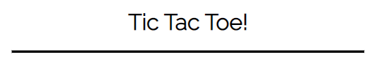
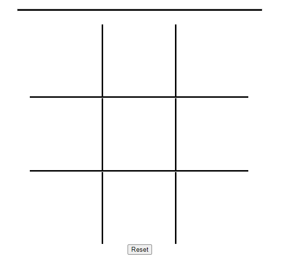
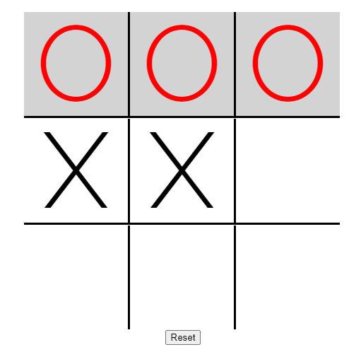

# Tic Tac Toe!
The Tic Tac Toe is a simple website that allows tow palyers to play tic tac toe against each other.

## Features.
### Existing Features.
The website is vary simple, consisting of a title and the plaing board.
The title.

The board.

Once a wining combination is inputed the game ends and a winner is declared by hilighting the tiles and text.

### Features left to implement.
A reset button as to not have to reload the page to play again.
Option to play against the computer by having the computer choose a tile at random.
## Testing.
The game works on all titles, you cannot reuse a tile in the same round and all Tic Tac Toe winning conditions are implemented and working.
### HTML.
* No errors were returned when passing through the official [W3C validator](https://validator.w3.org/nu/?doc=https%3A%2F%2Fcode-institute-org.github.io%2Flove-maths%2F).
### CSS.
No errors were found when passing through the official https://jigsaw.w3.org/css-validator/validator
### JavaScript.
No errors were found when passing through the official [Jshint validator](https://jshint.com/)
 Metrics
There are **4** functions in this file.
Function with the largest signature take **0** arguments, while the median is **0**.
Largest function has **29** statements in it, while the median is **12**.
The most complex function has a cyclomatic complexity value of **18** while the median is **5.5**.

How ever 16 warnings have been returned.
### Content. 
Used this tutorial.https://www.youtube.com/watch?v=AzvpHNkjqsg. 

